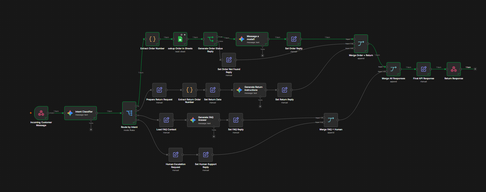
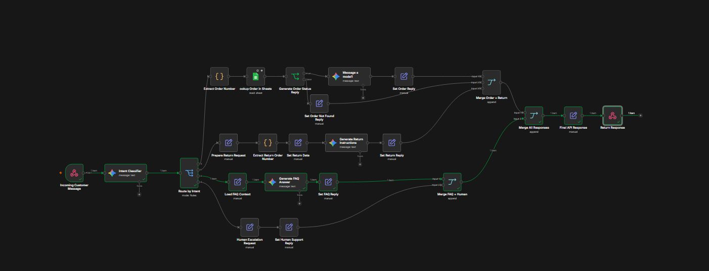
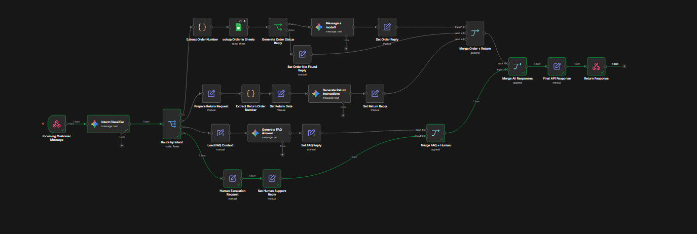

# AI E-commerce Support Agent

AI-powered customer support workflow built with n8n, Google Gemini and Google Sheets.

## Overview

This project automates customer support for an e-commerce business using Artificial Intelligence.

The workflow receives customer messages, identifies the customer's intent, routes the request to the appropriate process, and generates personalized responses.

## Features

* Intent Classification using Google Gemini
* Order Tracking Automation
* Return Request Handling
* FAQ Automation
* Human Support Escalation
* Google Sheets Integration
* Dynamic AI-generated Responses
* Webhook-based API
* Error Handling for Missing Orders

## Technologies

* n8n
* Google Gemini
* Google Sheets
* JavaScript
* Webhooks

## Workflow Architecture

```text
Customer Message
        ↓
Intent Classifier
        ↓
Intent Router
    ├── Track Order
    ├── Return Product
    ├── FAQ
    └── Human Support
        ↓
Response
```

## Supported Intents

| Intent         | Description                        |
| -------------- | ---------------------------------- |
| TRACK_ORDER    | Track customer orders              |
| RETURN_PRODUCT | Handle return requests             |
| FAQ            | Answer frequently asked questions  |
| HUMAN_SUPPORT  | Escalate requests to a human agent |

## Demo Video

A complete demonstration of the workflow execution is available in this repository.

Video file:

* 2026-06-01 11-54-40.mp4

## Workflow File

The complete n8n workflow can be imported directly into n8n.

Workflow file:

* AI E-commerce Support Agent.json

## Example Request

```json
{
  "message": "Where is my order 12345?"
}
```

## Example Response

```json
{
  "reply": "Your order #12345 is currently in transit and expected to arrive soon."
}
```

## Screenshots

### Workflow Overview


### Track Order Flow



### Track Order Response


### FAQ Flow



### FAQ Response


### Return Product Flow


### Return Product Response


### Human Support Flow



### Human Support Response


### Order Not Found Flow


### Order Not Found Response


## How It Works

1. Customer sends a message through the API.
2. Google Gemini classifies the customer's intent.
3. The workflow routes the request to the correct path.
4. For order tracking requests, Google Sheets is queried.
5. Gemini generates a contextual response.
6. The API returns the final response.

## Future Improvements

* WhatsApp Integration (Evolution API)
* Database Integration
* Customer Authentication
* Order History Retrieval
* Multi-language Support

## Author

Developed by João Gabriel Nazzi

## License

This project is licensed under the MIT License.
